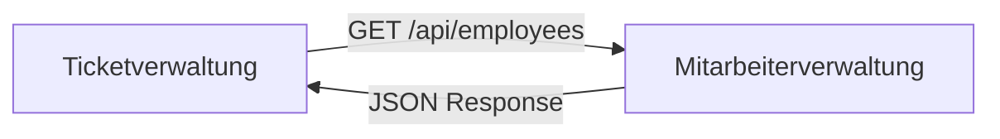

# Cross-Service Communication Contract

Diese Dokumentation beschreibt, wie die Services `Ticketverwaltung` und `Mitarbeiterverwaltung` miteinander kommunizieren.

## Architektur
Die `Ticketverwaltung` ist ein **Consumer** des `Mitarbeiter-Services`. Vor jeder Ticket-Erstellung wird geprüft, ob der angegebene Mitarbeiter existiert.



## Datenformat (Contract)
Die `Ticketverwaltung` erwartet folgendes JSON-Format von `Mitarbeiterverwaltung`:

```json
[
  {
    "id": "uuid-string",
    "firstName": "String",
    "lastName": "String"
  }
]
```

## Integration Tests
Um sicherzustellen, dass die Kommunikation stabil bleibt, wurden folgende Tests implementiert:

1.  **Postman System Tests**: Testen die echten laufenden Instanzen in der CI-Pipeline.
2.  **MitarbeiterServiceDependencyTest**: Ein Java-basierter Integrationstest in `Ticketverwaltung`, der mit WireMock sicherstellt, dass:
    - Valide Antworten korrekt gemappt werden.
    - Leere Listen korrekt verarbeitet werden.
    - Service-Fehler (500) erkannt werden.

## Fehlerbehandlung
Wenn der Mitarbeiter-Service nicht erreichbar ist oder einen Fehler liefert, wirft die `Ticketverwaltung` eine `ResponseStatusException` mit dem entsprechenden HTTP-Status (meist 400 oder 500).
